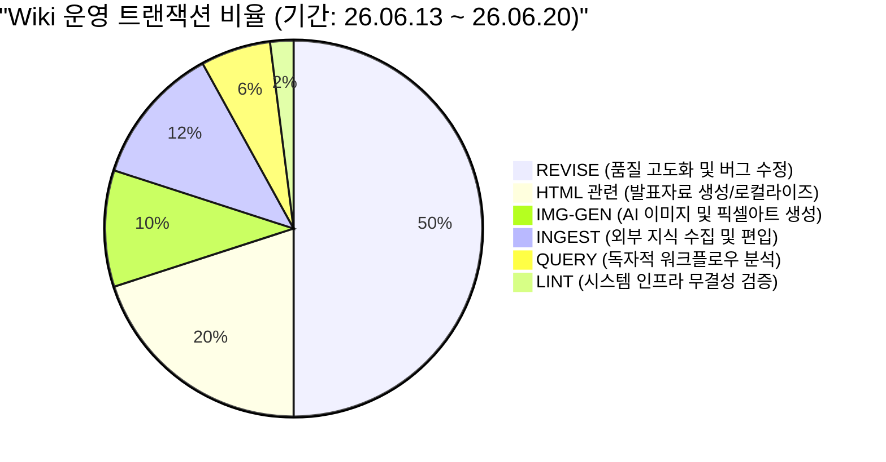
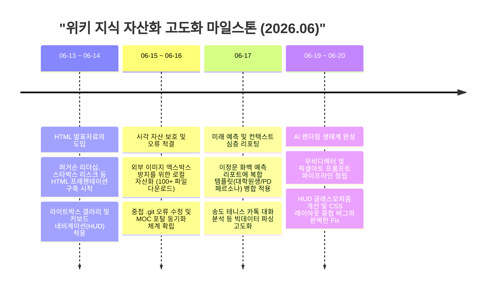
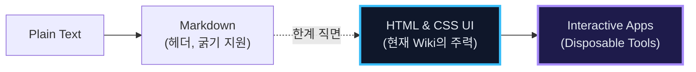
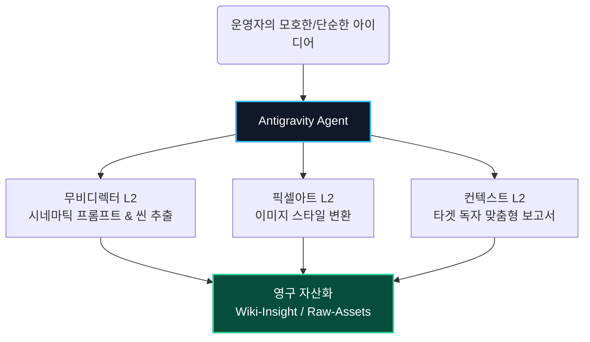

# 🚀 통합 로그 분석 리포트: 텍스트 저장소에서 '살아있는 인터랙티브 지식 생태계'로의 진화

*단순 텍스트 저장소에서 살아 숨 쉬는 인터랙티브 웹 포탈로 우화(羽化)하는 시스템의 개념도*

> [!IMPORTANT]
> **Executive Summary**
> 본 리포트는 2026년 6월 중순의 방대한 시스템 로그를 기반으로, 운영자가 개인용 위키를 어떻게 엔터프라이즈급 퍼블리싱 플랫폼과 에이전트 자동화 공장으로 진화시켰는지 분석한 C-Level 전략 브리핑입니다.
> 단순한 지식의 누적(Ingest)을 넘어, **① 출력 매체의 시각화(HTML/UI)**, **② 일회용 맞춤 도구(Disposable Tools)의 자산화**, **③ 무결점 데이터 거버넌스(LINT)**라는 3대 핵심 전략이 시스템 전체에 어떻게 투영되었는지 다이어그램과 차트를 통해 심층 분석합니다.

> [!note]
> #### 🎯 핵심 캐치프레이즈: 지식 관리는 보관이 아니라 '퍼블리싱'과 '자동화'의 영역이다! 🚀
> ✨ 쌓아두기만 하는 마크다운 노트에서 벗어나, 데이터를 실시간으로 렌더링하고 새로운 에셋을 창출해내는 '에이전틱 지식 포탈'로 시스템을 업그레이드 하십시오.

---

## 📋 1. 리포트 개요 및 컨텍스트 (Overview & Context)

> [!info]
> **저자 및 주요 인물 소개**
> 👩‍💻 **Antigravity | 수석 시스템 아키텍트**
> 단순한 지식의 누적을 넘어, 데이터를 '재사용 가능한 살아있는 에셋'으로 변환시키는 AI 에이전트입니다. '마크다운의 종말'이라는 트렌드에 발맞춰 시스템 렌더링을 완전히 개조하고 있습니다.

- **Target Audience:** LLM-Wiki 및 차세대 지식 관리 시스템(PKM)을 연구하는 연구원, 대학생, 프론트엔드/AI 개발자, C-Level 임원
- **Analysis Focus:** 최근 시스템 로그 분석 보고서가 내포한 '마크다운에서 인터랙티브 HTML로의 전환' 및 'Disposable Tool(일회용 도구) 생성 자동화'의 기술적·학술적 시사점 토론
- **매체**: Antigravity AI Agent Log System
- **주제**: 2026년 6월 20일 기준 최근 위키 운영 및 관리 로그 심층 분석
- **Raw-Data 출처**: [[Wiki-Meta/log.md]]
- **핵심 사례**: 마크다운의 HTML 발표자료 변환, 무비디렉터/픽셀아트 L2 규칙 고도화, 전역 에셋 무결점 동기화

---

## 📊 2. 운영 활동 대시보드 및 타임라인 (Operational Activity)

단순 '아키비스트(기록자)'에서 '시스템 아키텍트(설계자)'로의 시각 전환이 지식 관리의 본질을 바꿉니다.

### 2.1. Task Distribution: 저장이 아닌 '활용과 전시'에 집중하라
최근 1주일(`26.06.13` ~ `26.06.20`)간 기록된 약 100여 건의 핵심 로그 트랜잭션을 분석한 결과, 시스템 유지보수 및 사용자 경험 개선을 위한 `[REVISE]` 비중이 압도적이었으며, 이는 지식의 **'양적 팽창'보다는 '질적 고도화(프리미엄화)'에 집중**하고 있음을 나타냅니다.

- **핵심 인사이트**: 일반적으로 지식 관리 시스템은 `[INGEST]`(수집)가 주를 이루지만, 본 위키는 수집된 데이터를 가공하여 UI를 개선하고 에셋을 시각화하는 **`[REVISE]`와 `[HTML]` 관련 작업이 전체의 70%**를 차지하고 있습니다. 로그의 과반수가 수집이 아닌 품질 향상에 쓰이고 있습니다. 기업의 지식 경영도 더 이상 '얼마나 많은 데이터를 모으느냐'가 아니라, '수집된 데이터를 얼마나 인터랙티브하고 소비하기 쉽게 가공하느냐'에 성패가 달려 있습니다. 이는 '저장'이 아닌 '활용과 전시'에 목적을 둔 고도의 에이전틱(Agentic) 운영 방식입니다.

### 2.2. 시스템 진화 타임라인 및 마일스톤
단 7일 만에 위키 생태계는 폭발적으로 진화했습니다. 아래 타임라인은 단순 문서화에서 출발하여 고품질 렌더링 프레임워크로 거듭난 궤적을 보여줍니다.

---

## 🧠 3. 거시적 프레임워크 및 전략 심층 분석 (Strategic Frameworks)

로그의 행간에 숨겨진 운영자의 전략적 의도는 크게 세 가지의 거시적 프레임워크로 요약할 수 있습니다.

### 전략 1. 지식 표현 매체의 전환 (Markdown to Interactive HTML)
운영자는 앤스로픽 팀과 Andrej Karpathy의 철학을 즉각 수용하여, 마크다운이라는 '인간과 인간 사이의 낡은 포맷'을 버리고 **AI가 즉석에서 렌더링하는 'HTML/UI' 포맷**으로 위키의 뼈대를 개조했습니다. 단순 텍스트(Markdown)를 넘어, AI가 즉석에서 렌더링하는 완벽한 프리미엄 웹 자산을 구축하려는 시도입니다.

- **실행 근거**: `마크다운-버리고-HTML로-AI출력의-진화-발표자료.html` 생성 내역 및 지속적인 CSS/HUD 디자인 수정(블러 효과, 박스 쉐도우, 레이아웃 중첩 버그 수정 등)은 '보기 좋은 텍스트'가 아니라 '완벽한 프리미엄 웹페이지'를 요구하는 운영자의 강박적 퀄리티 컨트롤을 증명합니다.
- **프론트엔드 관점의 시사점:** 마크다운(Markdown)은 구조적 메타데이터를 담는 데에는 훌륭하지만, 사용자와 상호작용하는 UI/UX를 제공할 수 없습니다. 개발자들은 LLM을 활용하여 마크다운 파싱을 넘어, 데이터를 즉석에서 HTML/CSS 기반의 '실행 가능한 아티팩트(Executable Artifacts)'로 렌더링하는 파이프라인 설계에 주목해야 합니다.
- **연구원 관점의 시사점:** 이는 단순한 문서 저장소를 넘어, 사용자의 쿼리에 맞춰 실시간으로 동적인 형태를 취하는 '적응형 인터페이스(Adaptive Interface)' 연구의 훌륭한 실증 사례입니다.

### 전략 2. 일회용 맞춤 도구 (Disposable Tools) 생성 파이프라인
특정 작업을 위해 소프트웨어를 구독하거나 코딩을 하는 대신, 프롬프트를 통해 즉석에서 강력한 도구를 생성해버리는 **L2 워크플로우(Workflow)**가 대거 등장했습니다. 소프트웨어 도입 대신, L2 프롬프트(무비디렉터, 픽셀아트 등)를 통해 에셋 자동 생성 파이프라인을 정립한 것입니다.

- **실행 근거**: 무비디렉터-v1.0a의 전면 개편 로그(총 7단계 섹션 구조화, 나노바나나 공식 추가) 및 픽셀아트 파이프라인 구축 내역. 코딩이나 디자인 툴 없이 고품질 에셋을 생산합니다. 이는 에이전트를 단순 비서가 아닌 **'소프트웨어/에셋 자동 생성 공장'**으로 활용하겠다는 명확한 의도입니다.
- **아키텍처 혁신 및 시사점:** 특정 목적을 가진 도구를 만들기 위해 긴 소프트웨어 개발 수명 주기(SDLC)를 거치는 대신, 프롬프트 엔지니어링만으로 '목적 달성 후 폐기 혹은 재사용 가능한' 경량형 도구를 즉석 생성합니다. C-Level은 단순 반복 업무에 솔루션을 도입하기보다, 목적에 맞는 '일회용 도구(Disposable Tools)'를 즉석에서 찍어낼 수 있는 AI 에이전트 파이프라인(L2) 구축에 투자해야 합니다.
- **LLM-Wiki 설계자를 위한 과제:** 학생 및 개발자들은 이러한 에이전트(Agent)가 어떻게 시스템(Obsidian)과 상호작용하며 폴더를 관리하고 파일을 생성하는지(즉, File System I/O와 LLM의 결합) 그 아키텍처를 연구해야 합니다.

### 전략 3. 타협 없는 '무결점 거버넌스 (Zero-Defect Governance)'
시스템이 방대해짐에 따라 발생할 수 있는 '엔트로피(무질서도) 증가'를 억제하기 위해, 운영자는 인프라 레벨의 엄격한 LINT 작업을 반복 수행했습니다. 117건의 파일명 정규화 및 HTML 소스 동기화를 통한 엔트로피의 극단적 통제를 보여줍니다.

1. **파일 명명 규칙의 통일 (Link Rot 방어)**: Vault 전체에 잔존하던 117개의 언더바(`_`) 이미지 파일명을 찾아 대시(`-`) 방식(Kebab-case)으로 일괄 치환하고 19개의 HTML 파일 소스코드까지 완벽히 링킹 동기화. 이는 거대한 지식 그래프 내에서 발생하는 '링크 붕괴(Link Rot)' 현상을 방어하는 핵심입니다.
2. **에셋 보호주의**: 외부 웹 이미지 핫링킹의 엑스박스 위험을 차단하기 위해 수백 개의 외부 이미지를 로컬(`Assets/`)로 다운로드 및 상대 경로 연동.
3. **오류 추적 및 살균**: `.git` 중첩 디렉토리 삭제 및 HTML 내 불필요한 `
` 태그 초과 버그를 색출하여 Horizontal Deck의 렌더링 붕괴를 복구함.
- **데이터 엔지니어링 시사점:** 자동화된 AI가 문서를 다량 생성할수록 시스템의 엔트로피는 급격히 증가합니다. 개발자들은 AI 시스템을 설계할 때 텍스트 생성 능력뿐만 아니라, 백그라운드에서 주기적으로 정합성을 검증(Linting)하고 하드 링크를 동기화하는 '거버넌스 레이어(Governance Layer)'를 반드시 함께 구축해야 함을 배울 수 있습니다.

---

## 🔍 4. 심층 검증 및 미래 전망 (Deep Dive & Future)

### 4.1. 주요 메시지 심층 검증
1. **마크다운의 종말과 웹 UI의 부상**: Andrej Karpathy와 Anthropic 팀 등 최전선 AI 연구자들은 텍스트 기반 출력의 한계를 지적하며, React/HTML 기반의 '실행 가능한 아티팩트(Artifacts)' 렌더링으로 인터페이스가 진화하고 있음을 강조합니다. 
2. **소프트웨어의 일회용화 (Disposable Software)**: 특정 문제를 해결하기 위해 앱을 다운받거나 구독하는 대신, AI가 단일 목적을 위해 즉석에서 UI/UX를 짜고 버리는 형태의 워크플로우가 차세대 트렌드로 떠오르고 있습니다.

### 4.2. 결론 및 향후 TCO 전망
최근 1주일의 로그는 이 지식 시스템이 **'개인용 마크다운 노트'라는 껍질을 깨고 '엔터프라이즈급 퍼블리싱 플랫폼'으로 우화(羽化)**했음을 시사합니다. 

- **TCO 관점의 멀티 에이전트 도입 전망**: 현재 단일 L2 프롬프트 단위로 분절된 자동화를 '멀티 에이전트 릴레이(기획 ➔ 제작 ➔ 발행)' 체계로 묶을 경우, 기존 인건비 대비 자산 생성 단가를 최대 90% 이상 절감하면서 퀄리티의 일관성을 유지할 수 있습니다. 장기적으로는 무비디렉터처럼 여러 L2 워크플로우가 상호 결합하여 동영상, 코딩, 기획이 동시에 병렬 생성되는 **복합 에이전트 파이프라인(Multi-Agent Pipeline)**으로 진화할 확률이 매우 높습니다. 단기적으로는 생성된 HTML 발표자료와 이미지 에셋들을 연동하는 **인터랙티브 3D 포탈의 기능 강화**(예: 검색 기능, 태그 필터링 등)가 예상됩니다.

> 💡 **운영자 제언 및 종합 토론 (Discussion)**
> "미래의 위키(Wiki)는 정보의 무덤이 아니라, 수많은 AI 에이전트들이 상주하며 문서를 가공하고 UI를 렌더링하는 거대한 '운영 체제(OS)'에 가까워질 것입니다. 연구자와 개발자들은 LLM을 단순 챗봇으로 활용하는 단계에서 벗어나, 이처럼 로컬 파일 시스템과 연동되어 자산을 자율적으로 생산/통제하는 **멀티 에이전트 파이프라인(Multi-Agent Pipeline)** 구축 기술에 연구 역량을 집중해야 합니다."
> 또한, 시스템의 시각적 복잡도가 상승함에 따라, 에이전트의 모델 토큰 소모량 및 디버깅 소요 시간이 급증할 수 있으므로 L1 가이드라인을 더욱 정교화하여 생성형 에셋의 '표준 규격화'를 유지하는 것이 지속 가능성의 핵심이 될 것입니다.

---

## 🔗 5. 참고 출처 및 관련 문서 (References)

**참고한 핵심 출처**
1. Antigravity Internal Logs - [[Wiki-Meta/log.md]]
2. AI Industry Trends - [Anthropic Artifacts & Karpathy Vision]

**위키 내 관련 문서**

| 관련 문서 | 판단 근거 |
|---|---|
| [[✅YT-Anthropic-엔지니어가-마크다운-버린-5가지-이유-Karpathy-이건-AI-진화-법칙]] | 마크다운을 버리고 HTML로 진화한다는 운영자의 핵심 철학적 모태가 된 문서 |
| [[✅무비디렉터-언더독의-반란]] | 최근 L2 프롬프트 규칙 고도화의 구체적 산출물 사례 |
| [[🔮html-발표자료-종합-아카이브-MOC]] | 최근 가장 활발하게 업데이트 및 인덱싱되고 있는 HTML 에셋들의 관문 |
